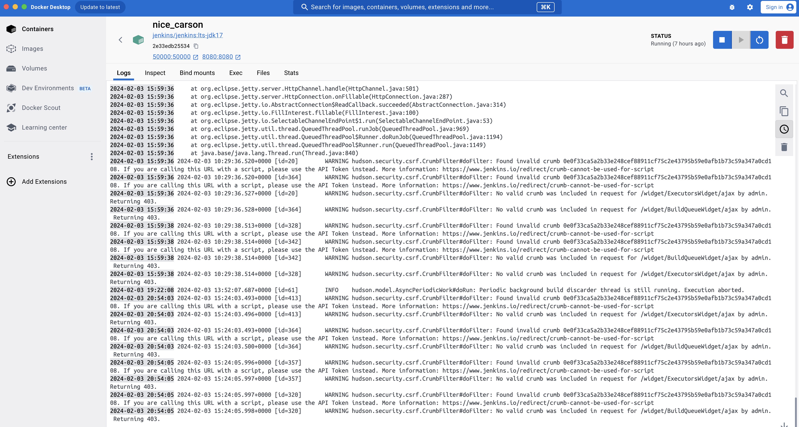

# Jenkins 

## Run jenkins using docker image
```
docker run -p 8080:8080 -p 50000:50000 --restart=on-failure -v jenkins_home:/var/jenkins_home jenkins/jenkins:lts-jdk17
docker ps
docker logs <jenkins_container_id/name>
docker volume inspect jenkins_home
```
Go to Volume in Docker desktop.  
Open jenkins_home volume.  
Save `/var/jenkins_home/secrets/initialAdminPassword` file in system.  
Open file in text editor to see initial password.  
Open `localhost:8080` to configure jenkins.

### Explore Jenkins container - 
```
docker ps
docker exec <jenkins_container_id/name> ls
docker exec -it -u root <jenkins_container_id/name> /bin/bash
apt-get update
exit
```
exec commands can also be directly executed from Exec tab in Docker desktop.



### Create first job -

#### Using Freestyle project
- Basic - java and git are installed by default in jenkins.


- Explore env variables - Can be directly accessed from http://localhost:8080/env-vars.html/


- NodeJS is not installed by default in jenkins server. We need to install NodeJS plugin and enable nodejs from Tools.


- Build a GIT repo


NOTE: Nodejs is not installed by default in jenkins image. If you want to install Nodejs, install Nodejs plugin in jenkins.


#### Using Pipeline - Script


#### Using Pipeline - Jenkinsfile


---

## References - 
[Jenkins documentation](https://www.jenkins.io/doc/)  
[Official Jenkins Docker image](https://hub.docker.com/r/jenkins/jenkins)  
[Jenkins Docker image documentation](https://github.com/jenkinsci/docker/blob/master/README.md)

--- 

## Todo
- setup jenkins server in local at jenkins-server.com
- checkout git repository and compile it
- jenkins + sonar integration
- Jenkins + coverage + lcov - upload coverage results on server
- play with env vars in a freestyle project, pipeline
- create a job to checkout github, gitlab repo and do npm install
- create a nodejs app container to checkout and do npm install
- jenkins administration, tools, credentials, plugins
- install nodejs in jenkins, how to manage different nodejs versions across project
- Execute bash commands in freestyle project pipeline
- explore node, agent, executors
- create docker agents to be scheduled by jenkins server