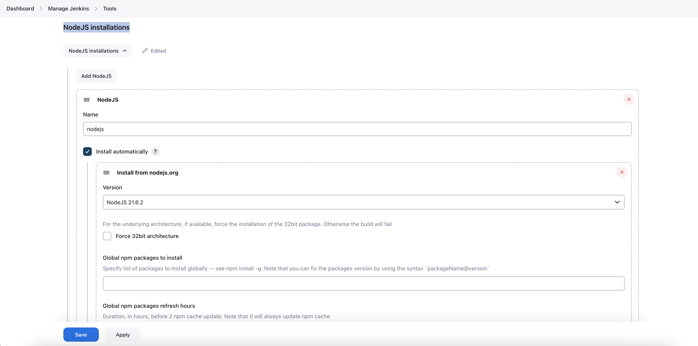
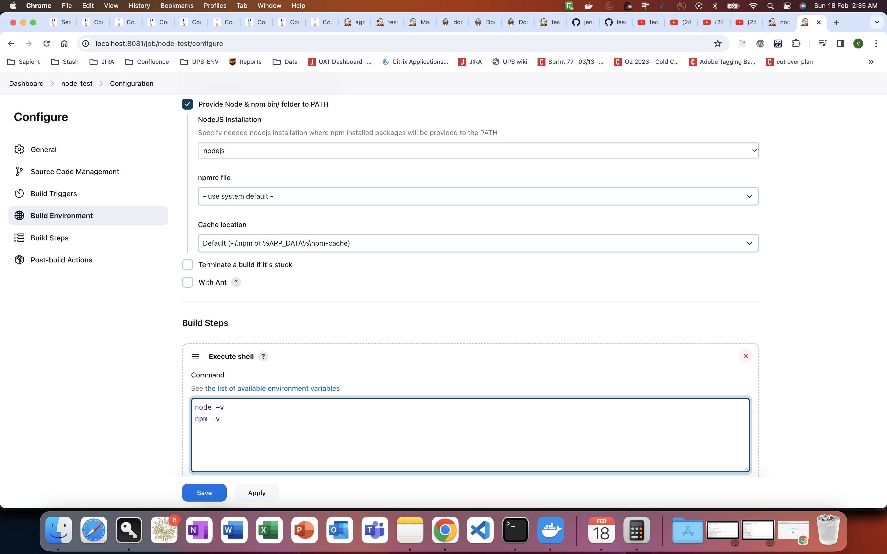
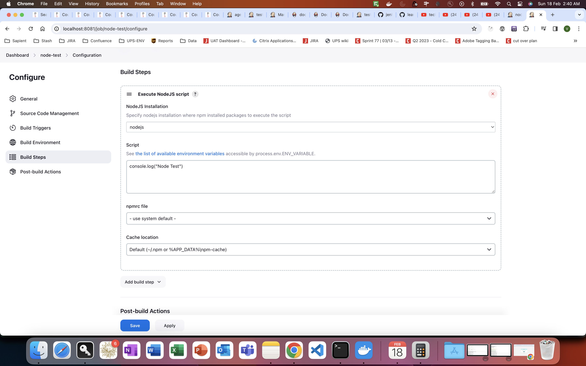

# Jenkins NodeJS Plugin

## Install NodeJS plugin
- Goto Manage Jenkins -> Plugins -> Available Plugins
- Search for NodeJS plugin
- Install in jenkins

## Using NodeJS in jenkins - 
- Goto Manage Jenkins -> Global Tools Configuration
- After NodsJS plugin is installed, NodeJS installations will become visible in Global Tools Configuration

## Test Installation - 
- Create a freestyle job.
- Configure tools to be used in pipeline in below step
- Mandatory to select - `Provide Node & npm bin/ folder to PATH`, when executing shell commands

## Execute NodsJS script -
- **NOT** Mandatory to select - `Provide Node & npm bin/ folder to PATH`, when executing shell commands

## References - 
- [NodeJS Plugin](https://plugins.jenkins.io/nodejs/)
- [NodeJS Pipeline step](https://www.jenkins.io/doc/pipeline/steps/nodejs/)