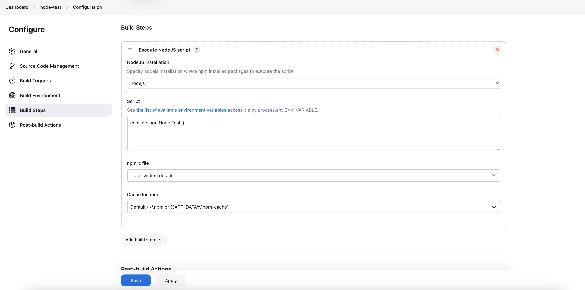

# Jenkins NodeJS Plugin

## Install NodeJS plugin
- Goto Manage Jenkins -> Plugins -> Available Plugins
- Search for NodeJS plugin
- Install in jenkins

## Using NodeJS in jenkins - 
- Goto Manage Jenkins -> Global Tools Configuration
- After NodsJS plugin is installed, NodeJS installations will become visible in Global Tools Configuration

## Test Installation - 
- Create a freestyle job.
- Mandatory to select - `Provide Node & npm bin/ folder to PATH`, when executing shell commands

## Execute NodsJS script -
- Mandatory to select - `Provide Node & npm bin/ folder to PATH`, when executing shell commands

