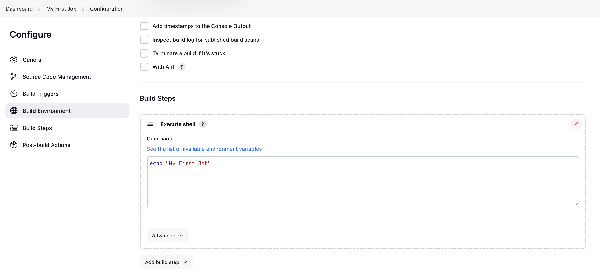
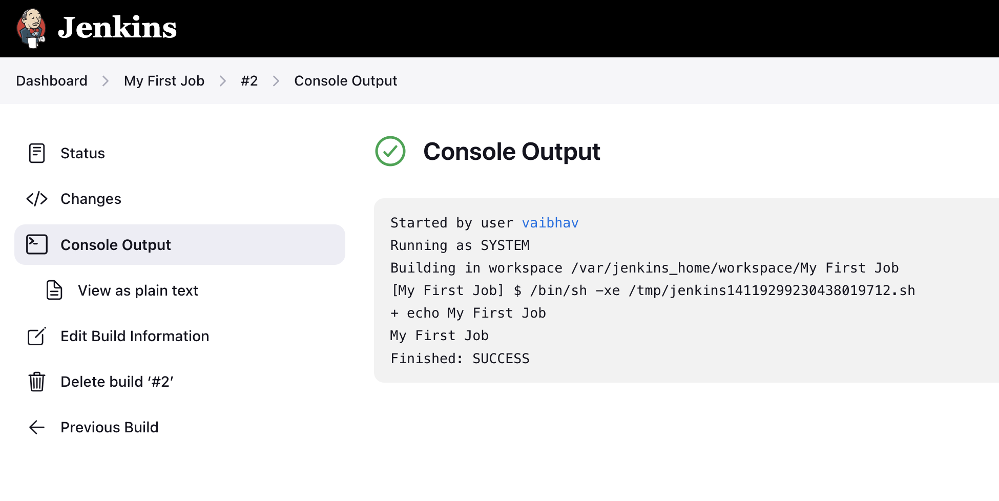

# Jenkins - Freestyle Project

Create jobs using Jenkins Freestyle project.


## Execute shell commands in Jenkins
- explore environment variables, tools installed in jenkins container
 
Env vars in jenkins can be accessed here - http://localhost:8080/env-vars.html/

```
java -version
git --version

#!environment variables-------------
printenv
env
printenv HOME
echo $HOME
echo $WORKSPACE
#!environment variables-------------

#!Linux commands-------------
ls
echo "My First Job"
whoami
#!Linux commands-------------
```
Shell Commands - 



Output - 




## Clone Github Repository

```
echo $WORKSPACE
ls
chmod -R 755 $WORKSPACE/
./scripts/shell.sh
$WORKSPACE/scripts/shell.sh
```

Shell Commands - 


Output - 


NOTE: 
- Nodejs is not installed by default in jenkins image. If you want to install Nodejs, install Nodejs plugin in jenkins.
- Jenkins has a number of plugins for invoking practically any build tool.


---

## References - 
[Jenkins documentation](https://www.jenkins.io/doc/)  

--- 
