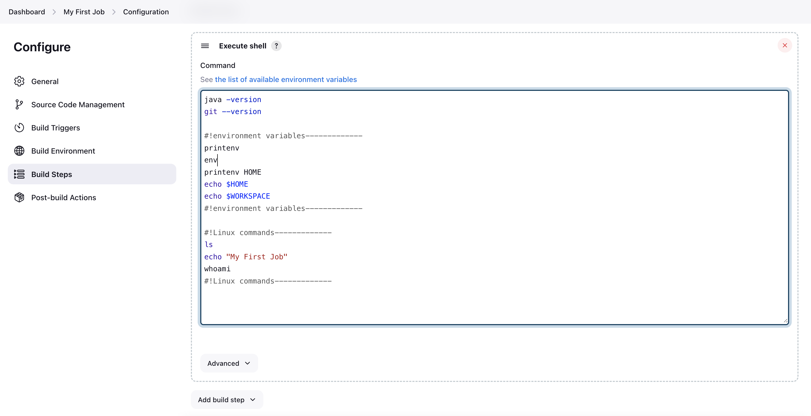
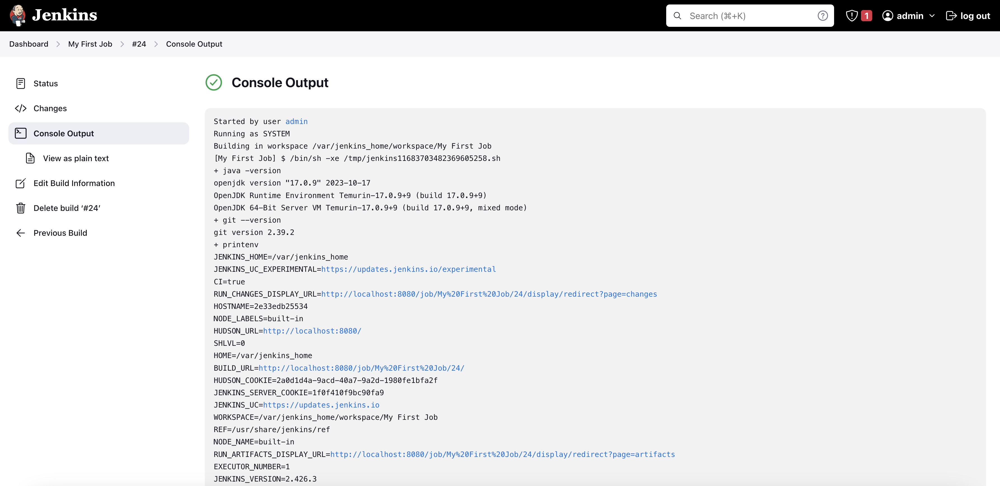

# Jenkins 

Create jenkins job using Freestyle project

- Basic - java and git are installed by default in jenkins.

Shell Commands - 
```
java -version
git --version

#!environment variables-------------
printenv
env
printenv HOME
echo $HOME
echo $WORKSPACE
#!environment variables-------------

#!Linux commands-------------
ls
echo "My First Job"
whoami
#!Linux commands-------------

sh 'echo "Hello World"'
```





- Explore env variables - Can be directly accessed from http://localhost:8080/env-vars.html/


- NodeJS is not installed by default in jenkins server. We need to install NodeJS plugin and enable nodejs from Tools.


- Build a GIT repo


NOTE: 
- Nodejs is not installed by default in jenkins image. If you want to install Nodejs, install Nodejs plugin in jenkins.
- Jenkins has a number of plugins for invoking practically any build tool.


---

## References - 
[Jenkins documentation](https://www.jenkins.io/doc/)  

--- 
