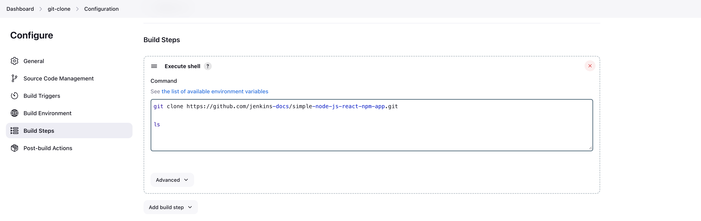

# Jenkins Github Integration

- Github allows connections to its repositories over HTTPS and SSH.

- Public repository can directly be cloned using shell command in job - git clone <github_repo_url>

## HTTPS

### Github - 
- Use Developer Settings to create a personal access token(pat).

### Jenkins - 
- Goto Credentials under Manage Jenkins
- Add Credentials under global scope
- Add github username and personal access token. Provide a description
- Create
- Goto job for which you want to checkout github repository. Select Configuration.
- Add Repository/credential 
- Run job
- Certificate error might error which will fail the checkout process
- For fixing certificate error - Set git config --global http.sslverify false

